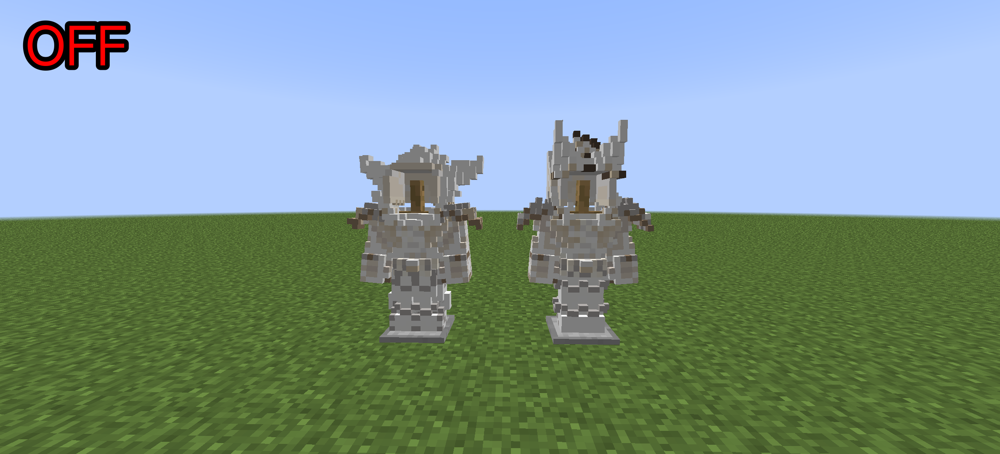

# 龙之研究盔甲渲染修复

[English](./README.md) | [中文版]

  

修复龙之研究（Draconic Evolution）1.7.10 盔甲渲染全白/异常的问题。兼容 GTNH 整合包与原版 Forge 1.7.10。

## 效果对比

| 开启（修复后） | 关闭（修复前） |
|---|---|
|  |  |

## 特点

- 修复龙之研究盔甲渲染全白/异常
- 兼容 GTNH 版与原版 Draconic Evolution（1.7.10）
- 纯 ASM CoreMod，不改动原模组文件
- 未安装龙之研究时自动跳过，不影响游戏

## 安装

1. 需要 Forge 1.7.10 和龙之研究（任意版本）
2. 把 jar 放进 `mods` 文件夹
3. 启动游戏即可

## 前置

- Draconic Evolution（任意版本）

## 赞助

## 作者

Xiaomo305Mua
