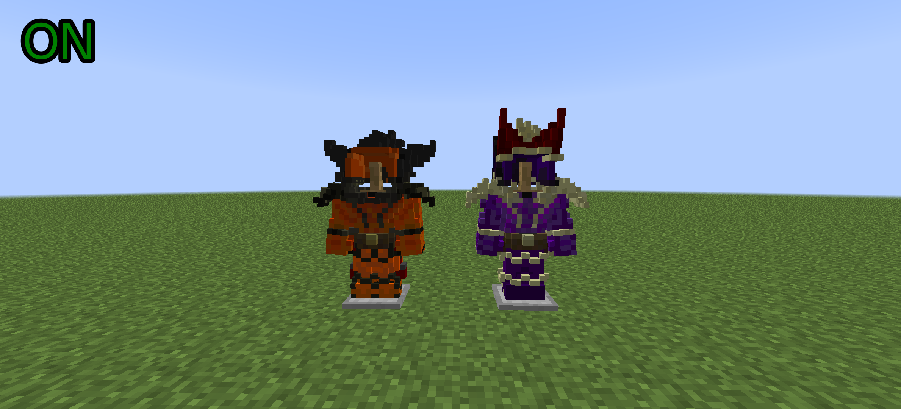
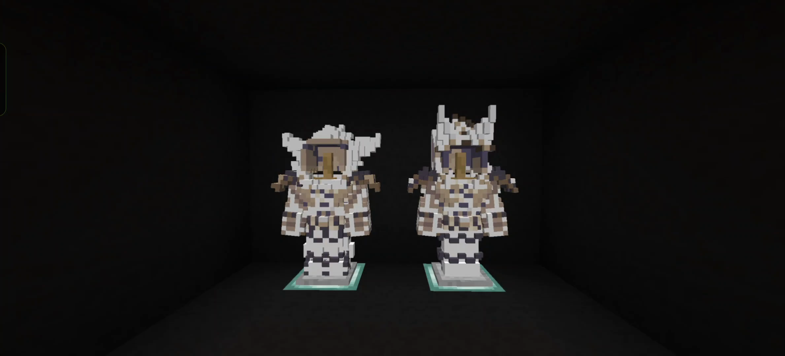

# Draconic Armor Render Fix

[English] | [简体中文](./README_zh_CN.md)

  

Fixes the color-loss rendering issue of Draconic Armor and Wyvern Armor in [Draconic Evolution](https://www.curseforge.com/minecraft/mc-mods/draconic-evolution) for 1.7.10 Forge.

Mainly targeting mobile devices, such as [Fold Craft Launcher](https://github.com/FCL-Team/FoldCraftLauncher) and [Zalith Launcher 2](https://github.com/ZalithLauncher/ZalithLauncher2).

Supports any version of Draconic Evolution and its forks.

> This is a **client-side mod**. Only needs to be installed on the client; the server does not need it.

## Comparison

| ON | OFF |
|---|---|
|  |  |

## Support

## License

This project is licensed under the [LGPL-3.0 License](./LICENSE)
